# Demo

See the app in action.

## Video Walkthrough

*Note: Generation wait times removed and video sped up for brevity.*

---

## Example Sessions

### 1. Warli Phone Case - Multi-Turn Refinement

Demonstrates iterative refinement with reference image support.

**Turn 1:** Initial generation with reference

<table>
<tr>
<td><strong>Reference</strong></td>
<td><strong>Generated</strong></td>
</tr>
<tr>
<td>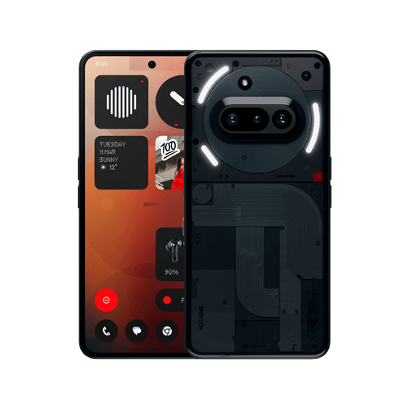</td>
<td>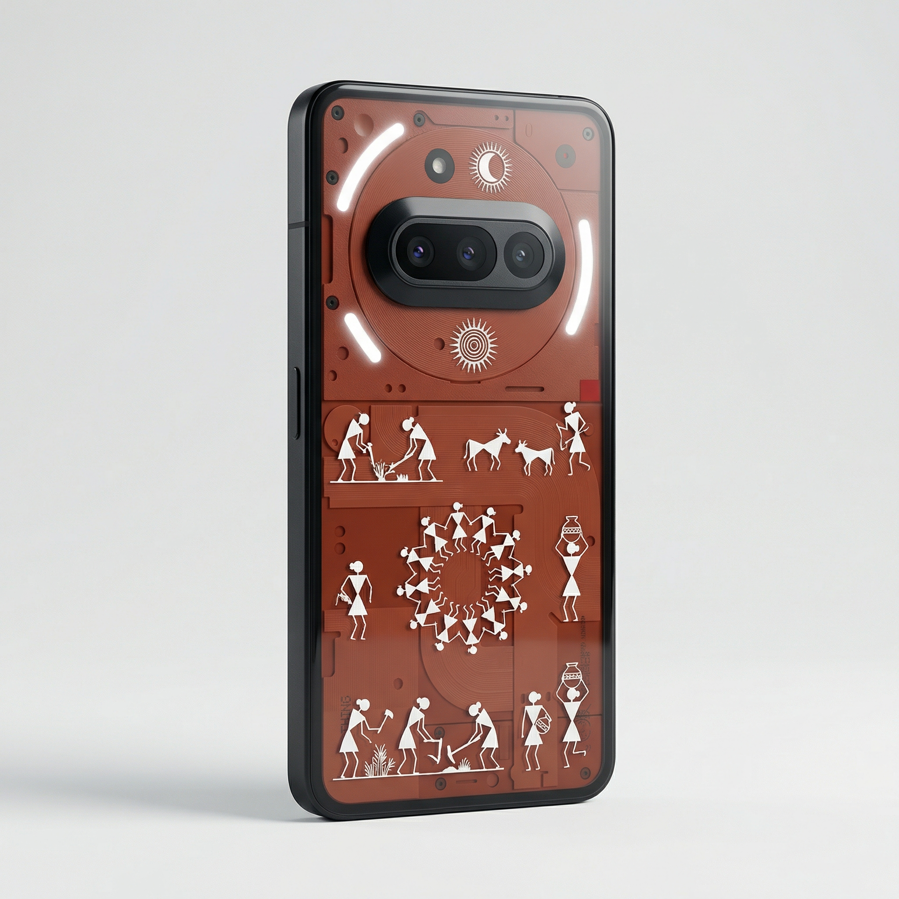</td>
</tr>
</table>

**Turn 2:** Add designs to top half

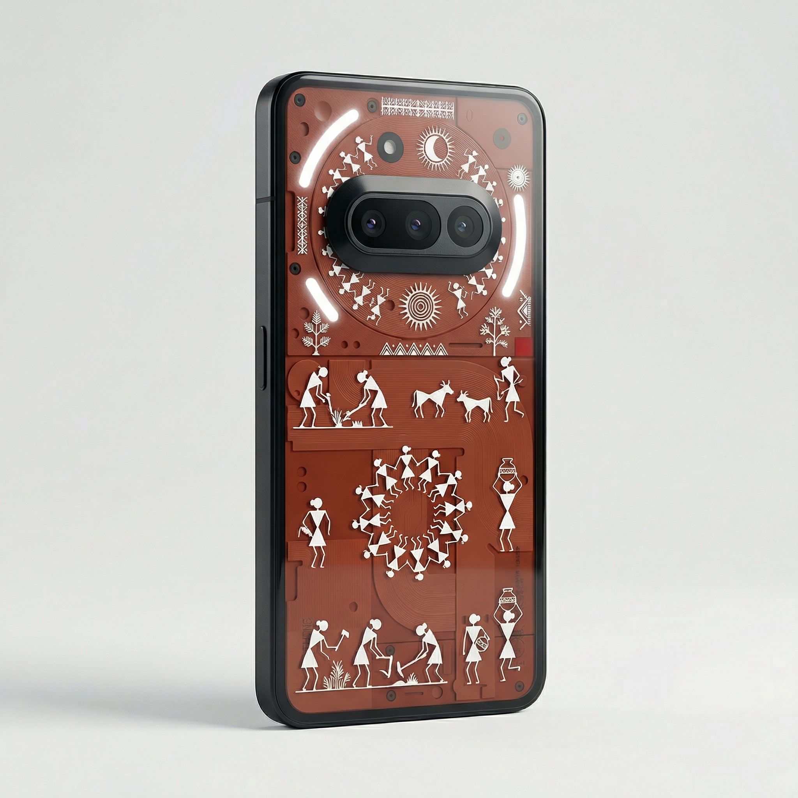

**Turn 3:** Different colors (selected both previous images)

<table>
<tr>
<td>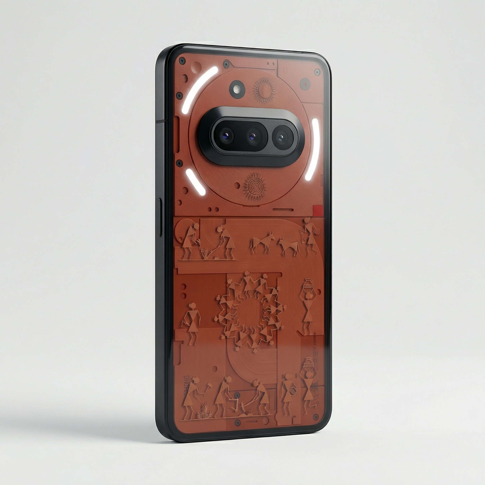</td>
<td>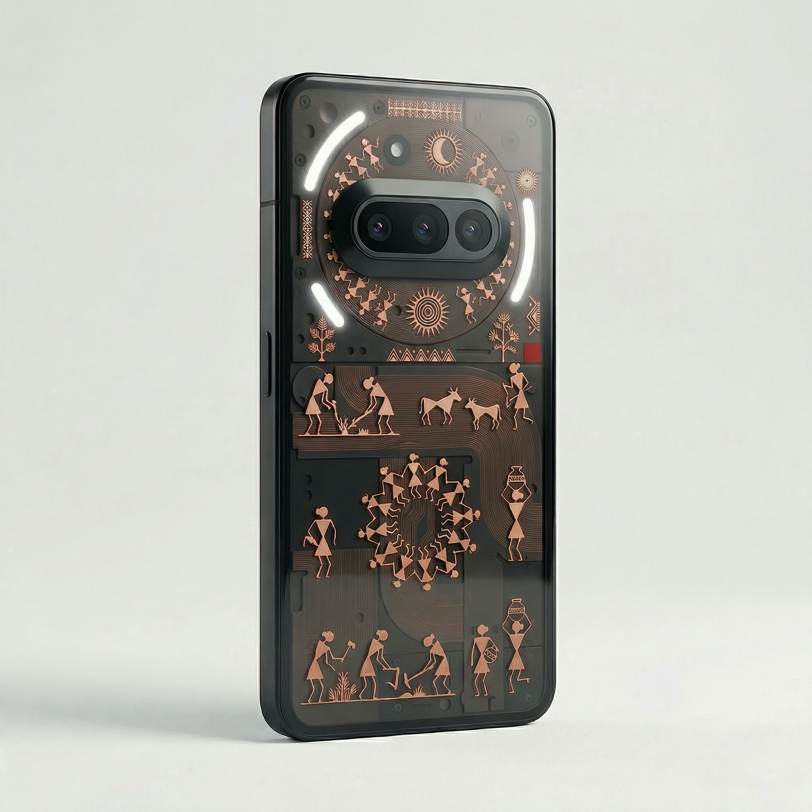</td>
</tr>
</table>

**Turn 4:** Add border (selected Turn 1 image)

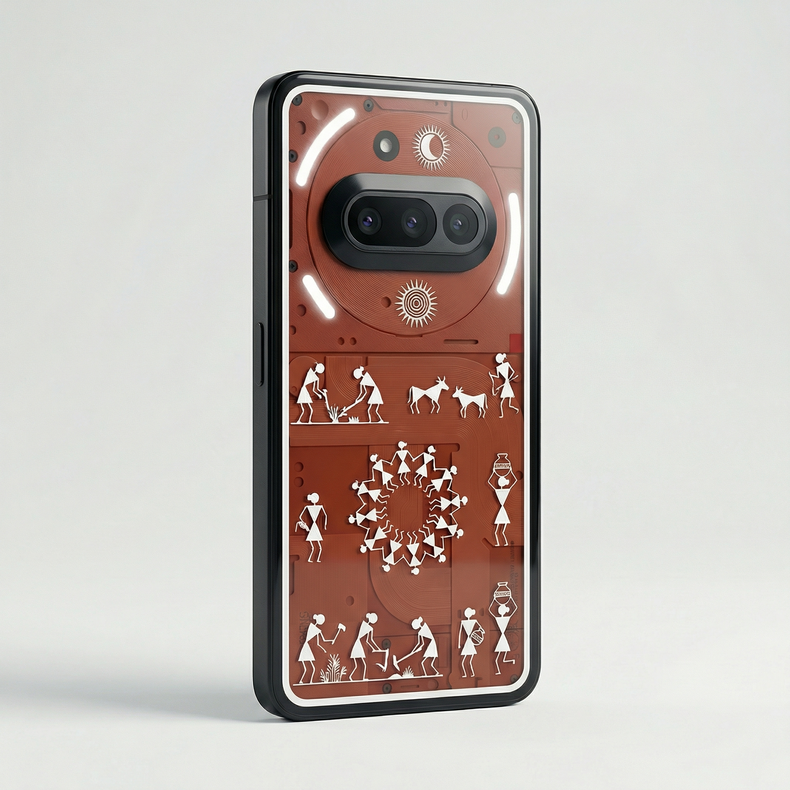

---

### 2. Madurkathi Tote Bag

Simple single-turn generation.

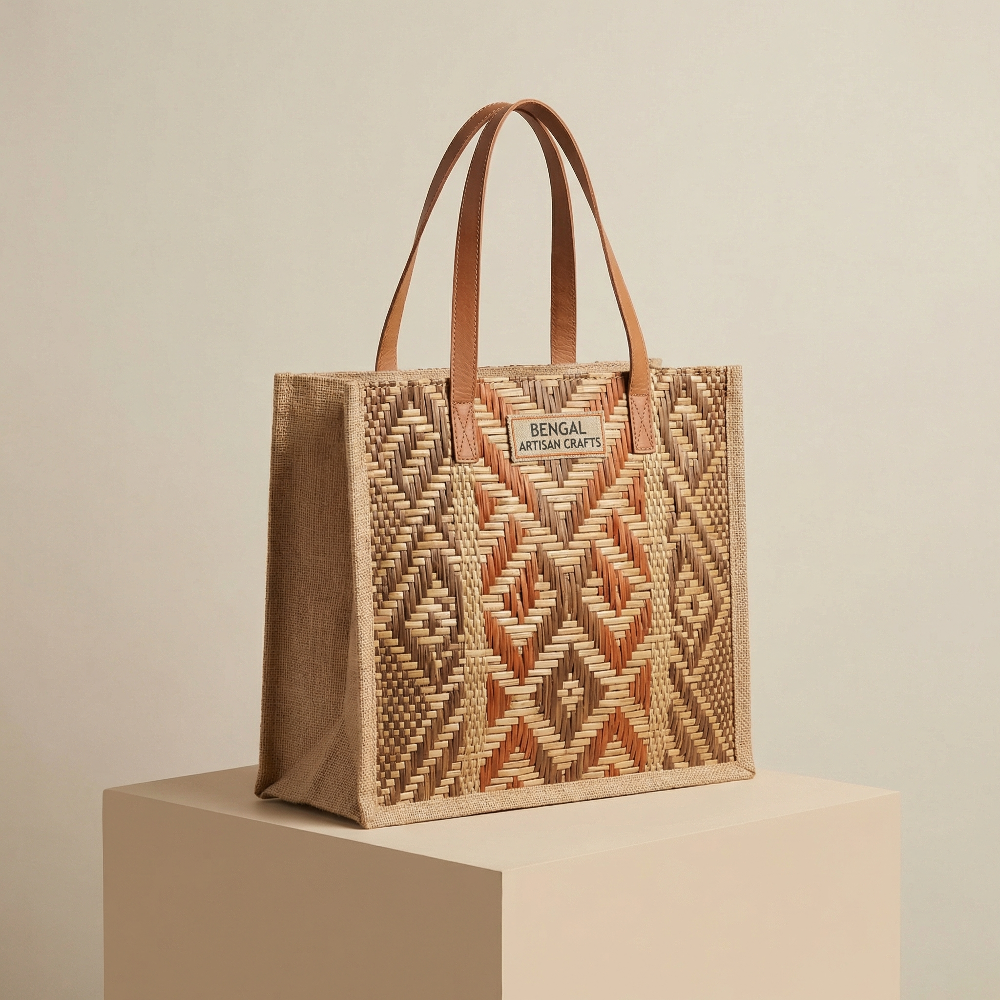

---

### 3. Blue Pottery Salt & Pepper Shakers

**Turn 1:** Generated 2 variations

<table>
<tr>
<td>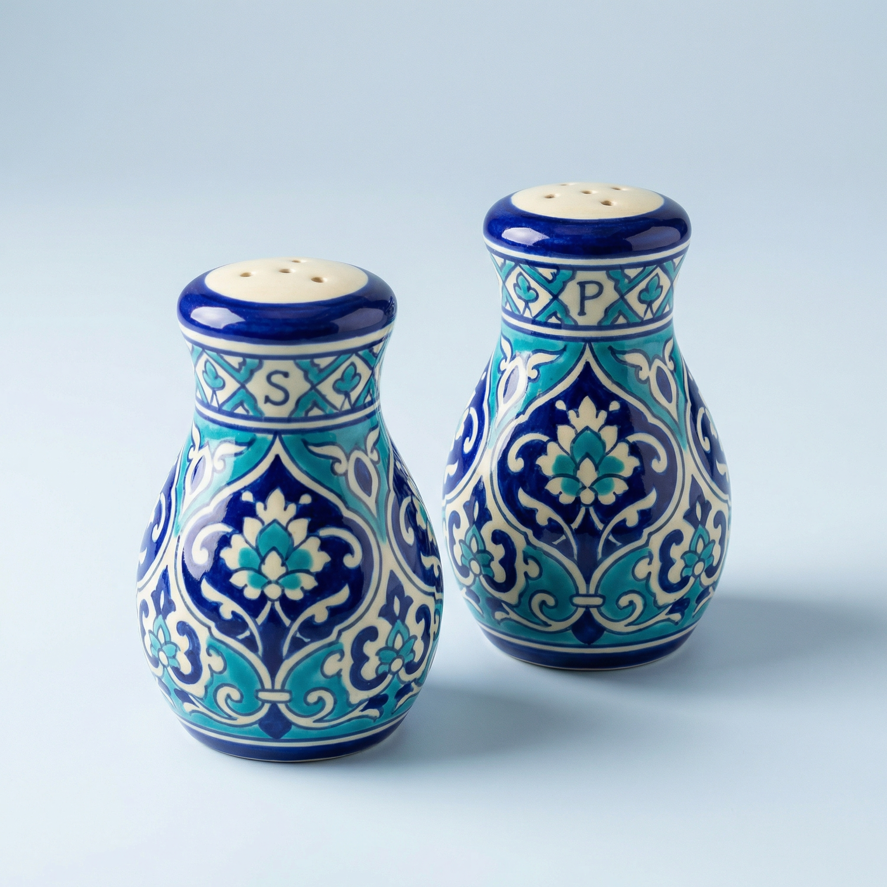</td>
<td>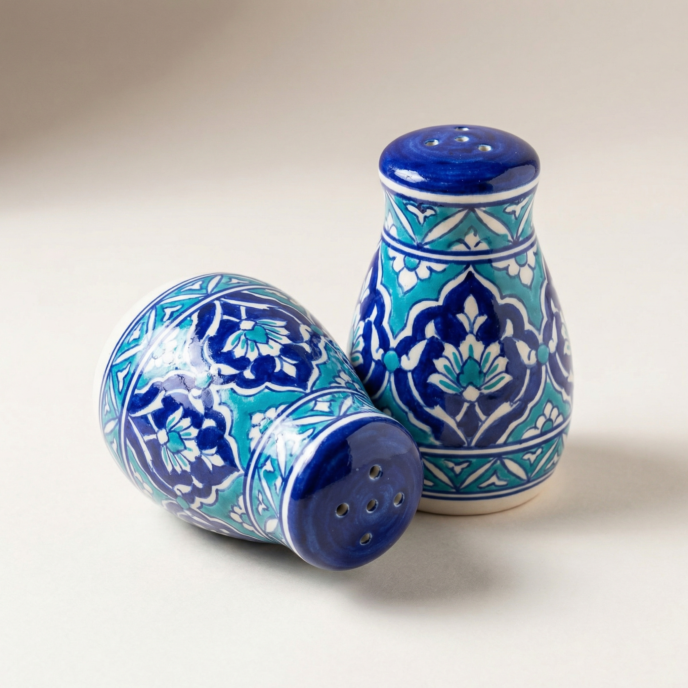</td>
</tr>
</table>

**Turn 2:** Changed design on pepper shaker (selected first image)

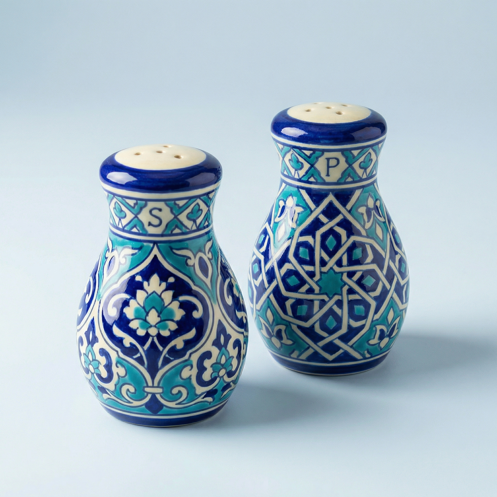

---

### 4. Warli Laptop Sleeve

Reference-based generation.

<table>
<tr>
<td><strong>Reference</strong></td>
<td><strong>Generated</strong></td>
</tr>
<tr>
<td></td>
<td>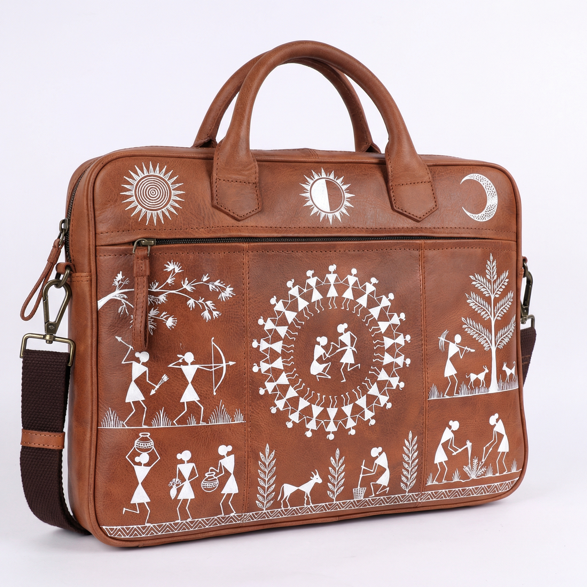</td>
</tr>
</table>

---

## Key Features

- **Multi-turn conversations** - Iteratively refine designs with natural language
- **Reference images** - Upload product references for better results
- **Selective modifications** - Choose specific images to modify
- **Parallel generation** - Generate multiple variations simultaneously
